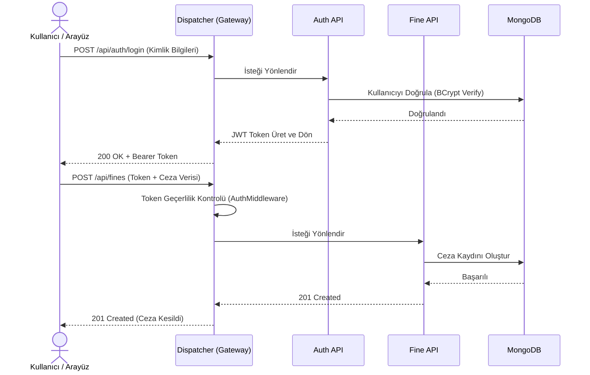
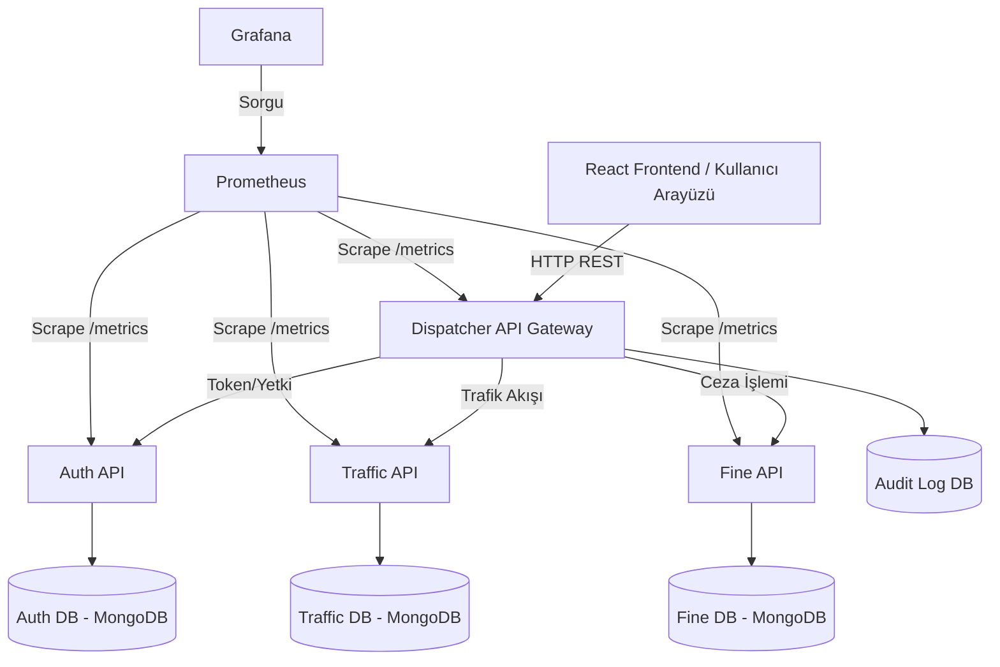

# Akıllı Şehir Trafik Kontrol Sistemi (SmartCity-Traffic-System)

---

## 1. Proje Bilgileri

**Proje Adı:** Akıllı Şehir Trafik Kontrol Sistemi  

**Ders:** Yazılım Geliştirme Laboratuvarı-II

**Bölüm:** Bilişim Sistemleri Mühendisliği

**Tarih:** 05.04.2026


Grup Üyeleri:


* 241307114 Ömer Faruk Güler (GitHub: @farukomerg)


* 231307064 Gülnihal Eruslu (GitHub: @gulni-hal)

---

## 2. Giriş ve Problemin Tanımı

Modern şehirlerdeki hızlı nüfus artışı, trafik yoğunluğunun ve kural ihlallerinin geleneksel sistemlerle takip edilmesini imkansız hale getirmiştir. Bu yapıların aşırı veri yükü altında darboğazlar (bottleneck) yaşaması, sistemin tamamen çökmesine veya yanıt sürelerinin uzamasına neden olmaktadır.

Bu projenin amacı şehir içi trafiği anlık olarak izleyebilen yoğunluk bölgelerini (hotspot) analiz eden ve hız ihlalleri gibi durumlarda otomatik ceza kaydı oluşturabilen yüksek erişilebilirliğe sahip ölçeklenebilir bir mikroservis mimarisi tasarlamaktır. Proje, API Gateway üzerinden güvenli (JWT destekli) bir yönlendirme sağlayarak anlık yüksek trafik yüklerini başarıyla karşılamayı hedeflemektedir.

---

## 3. Sistem Tasarımı, Restful Mimarisi ve Literatür İncelemesi

### 3.1. Restful Servisler ve Richardson Olgunluk Modeli (RMM)

REST (Representational State Transfer), web servisleri tasarlamak için kullanılan, istemci-sunucu bağımsızlığına dayanan bir mimari yaklaşımdır. Projemizdeki mikroservisler, Richardson Olgunluk Modeli'ne (RMM) göre değerlendirilmiş ve standartlara uygun olarak geliştirilmiştir:

- **Seviye 0 (POX):** Sadece tek bir URI ve tek bir HTTP metodu (genellikle POST) kullanılır. Projemiz bu seviyeyi aşmıştır.  
- **Seviye 1 (Kaynaklar):** Her verinin kendine ait bir URI'si vardır (Örn: /api/traffic/live).  
- **Seviye 2 (HTTP Fiilleri):** CRUD işlemleri için doğru HTTP fiilleri kullanılır (GET, POST, PUT, DELETE). Projemiz, uygun HTTP fiilleri ve HTTP durum kodları (200 OK, 201 Created, 401 Unauthorized vb.) kullanarak Seviye 2 standartlarını tam olarak karşılamaktadır.  

---

### 3.2. Sınıf Yapıları ve Algoritmalar

Sistem, Entity-Repository-Service-Controller (Katmanlı Mimari) yapısını temel almaktadır:

- **Auth Service:** User entity'sini yönetir. BCrypt algoritması kullanılarak şifreler tek yönlü olarak hashlenir. Bu algoritma, brute-force saldırılarını engellemek için bilinçli olarak CPU'yu yoran, iteratif bir güvenlik mekanizmasına sahiptir.  

- **Traffic Service:** Anlık trafik verilerini (Lokasyon, Araç Sayısı, Yoğunluk Seviyesi) toplar ve hotspot analiz algoritmaları ile belirli bir eşiğin üzerindeki lokasyonları filtreler.  

- **Fine Service:** Araç plakalarına kesilen cezaların (Fine entity) tutulduğu servistir.  

- **Dispatcher (API Gateway):** YARP tabanlı ters vekil sunucudur. İsteğin path'ine göre (Örn: /api/fines) hedef mikroservise yönlendirme (Routing Algorithm) yapar.  

---

### 3.3. Karmaşıklık Analizi (Complexity Analysis)

- **API Gateway Yönlendirmesi:** YARP, hash tabanlı veya trie (prefix tree) tabanlı route eşleştirme kullandığı için yönlendirme karmaşıklığı O(1) veya O(K) (K: URL uzunluğu) seviyesindedir.  

- **Kullanıcı Girişi ve Hash Doğrulama (Auth):** Veritabanından kullanıcıyı bulma işlemi indeksleme sayesinde O(log N) sürerken BCrypt şifre doğrulama işlemi iterasyon sayısına (work factor) bağlı olarak O(W) zaman karmaşıklığına sahiptir. Yük testlerinde (k6) görülen darboğazın ana sebebi bu işlemin asimptotik olarak yüksek CPU maliyetidir.  

- **Veri Yazma ve Okuma (MongoDB):** Indexlenmiş alanlar (Örn: Plaka veya Lokasyon ID) üzerinden yapılan sorgular B-Tree yapıları sayesinde O(log N) performansla çalışır.  

---

### 3.4. Sequence (Sıralı Akış) Diyagramı


## 4. Proje Modülleri ve Mimari Şema

Sistem izolasyonunu sağlamak amacıyla veritabanı her mikroservis (Database per Service pattern) için ayrılmış ve sistem sağlığı Prometheus & Grafana ile izlenebilir hale getirilmiştir.


## Modüllerin İşlevleri

- **React Frontend:** Son kullanıcının sisteme giriş yapabildiği, anlık trafik/ceza simülasyonu gönderebildiği ve iframe üzerinden Grafana panellerini izleyebildiği kontrol merkezidir.  
- **Dispatcher API (YARP):** Sistemin tek giriş kapısıdır. CORS politikalarını uygular, global hata yakalaması (Error Handling) yapar, JWT yetkilendirmesini denetler ve her isteği veritabanına loglar (Audit).  
- **Auth API:** JWT (JSON Web Token) altyapısını kullanarak kullanıcı oturumlarını yönetir.  
- **Traffic API:** Sensörlerden veya simülasyondan gelen anlık yoğunluk verilerini işler.  
- **Fine API:** Belirlenen kural ihlallerine yönelik plaka bazlı trafik cezalarını yönetir.  
- **Prometheus & Grafana:** Tüm mikroservislerin P95 yanıt sürelerini, anlık istek sayısını (RPS), hata oranlarını ve sistem sağlığını görselleştiren devops izleme modülüdür.

## 5. Performans ve Yük Testi (Load Testing) Raporu

**Test Aracı:** k6  
**Maksimum Eşzamanlı Kullanıcı (VU):** 500  
**Test Süresi:** ~5 Dakika  

---

### 5.1 Test Senaryosu

Sistemin yoğun istek altındaki davranışını ve API Gateway (Dispatcher) yönlendirme performansını ölçmek için kademeli olarak artan bir yük testi (ramp-up) uygulanmıştır. Test, sıfırdan başlayarak zirve noktası olan 500 eşzamanlı sanal kullanıcıya ulaşmış ve toplamda 5 dakika sürmüştür.

---

### 5.2 Her Sanal Kullanıcı (VU) İçin Gerçekleştirilen İşlemler

Uçtan uca (E2E) test akışı kapsamında her bir sanal kullanıcı döngüsel olarak aşağıdaki adımları simüle etmiştir:

1. **Kayıt Olma (Register):**  
   Yeni bir kullanıcı adı ve şifre ile Auth servisine kayıt işlemi (BCrypt hashing tetiklenir)

2. **Giriş Yapma (Login):**  
   Kayıt olunan bilgilerle sisteme giriş yapılıp JWT doğrulama token'ının alınması

3. **Fine Oluşturma:**  
   Alınan token kullanılarak Fine (Ceza) servisine POST isteği ile yeni bir ceza kaydının eklenmesi

4. **Traffic Hotspot Sorgusu:**  
   Token kullanılarak Traffic servisinden yoğun lokasyonların (hotspots) çekilmesi

---

### 5.3. Test Sonuçları

#### Genel İstatistikler

| Metrik | Değer |
|-------|------|
| Toplam Gerçekleşen İstek | 64,360 |
| Saniyedeki İstek (RPS) | 213.82 req/s |
| Tamamlanan Iterasyon | 16,090 |
| Gelen Veri (Data Received) | 16 MB (53 kB/s) |
| Giden Veri (Data Sent) | 13 MB (44 kB/s) |

---

### 5.4. Yanıt Süreleri (Response Times)

| Metrik | Değer |
|------|------|
| Ortalama (AVG) | 796.01 ms |
| Minimum (MIN) | 2.16 ms |
| Medyan (MED) | 298.78 ms |
| P90 | 2.56 s |
| P95 | 3.31 s |
| Maksimum (MAX) | 8.53 s |

Not: İsteklerin %95’i 3.31 saniye veya daha kısa sürede tamamlanmıştır.

---

### 5.5. Hata Oranı (Fail Rate)

| Metrik | Değer |
|------|------|
| Başarısız İstek Oranı | %12.76 |
| Başarılı İstek Sayısı | 56,147 |
| Başarısız İstek Sayısı | 8,213 |

---

### 5.6. Threshold (Eşik) Durumu
**Durum:**  
Test için belirlenen hedefler:

- P95 < 2 saniye  
- Hata oranı < %1  

500 eşzamanlı kullanıcının oluşturduğu ağır yük altında bu hedefler aşılmıştır.

---
## 6. Analiz ve Yorum

### 6.1. Güçlü Yönler

- **Yüksek İstek İşleme Kapasitesi:**  
  Sistem 5 dakika gibi kısa bir sürede 64 binden fazla isteği (%87.24 başarı oranı ile) işlemeyi başarmıştır. Saniyede 213 isteğe (RPS) ulaşılması, API Gateway (Dispatcher) ve mikroservis iletişiminin temel seviyede stabil olduğunu göstermektedir.

- **Throughput (RPS):**  
  Saniyede 213 istek işlenmesi, Dispatcher (API Gateway) ve mikroservis mimarisinin temel seviyede stabil çalıştığını göstermektedir.

- **Medyan Yanıt Süresi:**  
  Medyanın 298 ms seviyesinde kalması, sistemdeki isteklerin büyük bir çoğunluğunun aslında oldukça hızlı işlendiğini kanıtlamaktadır. Gecikmelerin geneli, yükün tepe (pik) yaptığı anlarda yığılan isteklere aittir.
---

### 6.2. Zayıf Yönler ve Darboğazlar (Bottlenecks)

#### 1. Hata Oranının Artışı (%12.76)

Kullanıcı sayısı 500'e ulaştığında sistem darboğaza girmiştir. Kurgulanan senaryodaki Auth servisi üzerinde sürekli çalışan "BCrypt" şifreleme algoritması, ciddi bir CPU yükü yaratmaktadır.

---

#### 2. Auth Servisi CPU Darboğazı

- Senaryoda her istekte **register + login** işlemi yapılmaktadır.
- BCrypt hashing algoritması yüksek CPU maliyetine sahiptir.
- Bu durum Auth servisinde ciddi performans düşüşüne neden olmuştur.

---

#### 3. Zincirleme Gecikme Etkisi

- Auth servisi geciktiğinde:
  - Token üretilememektedir
  - Dispatcher (YARP) timeout yaşamaktadır
  - Fine ve Traffic servisleri çağrılamamaktadır

- Maksimum yanıt süresi: **8.53 saniye**

- Toplam hataların büyük kısmı bu zincirleme etkiden kaynaklanmaktadır.

---


### 6.3. İzleme ve Metrik Görselleri (Grafana Dashboards)

Sistemin yük altındaki davranışını gösteren Grafana panelleri aşağıda sunulmuştur:

| Grafik | Sonucu |
|------|------|
| Traffic Hotspot Sorgu Sayısı | |
| Auth Login Başarı | |
| Fine Oluşturma | |
| P95 Response Süresi | |
| Job Bazlı Aktif İstek | |
| Toplam İstek Hızı | |

Not: Bu metrikler Prometheus üzerinden toplanarak Grafana dashboard’ları ile görselleştirilmiştir.
  

## 7. Sistemi Ayağa Kaldırma (Kurulum)

Projenin bağımlılıklarının ve altyapısının izole bir şekilde çalışması için Docker ve Node.js kullanılmıştır.

### 7.1. Mikroservisler ve Veritabanlarını Başlatma (Docker)

Sistemin kök dizininde (docker-compose.yml dosyasının bulunduğu yer) aşağıdaki komutu çalıştırarak tüm arka plan servislerini ayağa kaldırın:

```bash
docker-compose up --build -d
```
Bu komut; MongoDB veritabanlarını, 4 farklı mikroservisi (Auth, Traffic, Fine, Dispatcher), Prometheus'u ve Grafana'yı otomatik olarak kurup çalıştıracaktır.

### 7.2. Kullanıcı Arayüzünü Başlatma (React/NPM)
```bash
cd frontend
npm install
npm run dev
```
Erişim Adresleri:

- Frontend Arayüzü: http://localhost:5173

- Dispatcher (Gateway): http://localhost:5000

- Grafana İzleme Paneli: http://localhost:3000


## 8. Sonuç ve Tartışma

Akıllı Şehir Trafik Kontrol Sistemi projesi, artan şehir trafiği verilerinin ve kural ihlallerinin modern yazılım mimarileri kullanılarak nasıl ölçeklenebilir bir şekilde yönetilebileceğini göstermek amacıyla geliştirilmiştir. Proje kapsamında elde edilen başarılar, sistemin sınırlılıkları ve gelecekteki olası geliştirmeler aşağıda detaylandırılmıştır.

### 8.1. Proje Başarıları

**Başarılı Mikroservis ve API Gateway Entegrasyonu:** Sistem, tek bir monolitik yapı yerine sorumlulukların dağıtıldığı (Auth, Traffic, Fine) bir mikroservis mimarisine oturtulmuştur. YARP (Yet Another Reverse Proxy) kullanılarak tasarlanan Dispatcher, tüm istekleri tek bir kapıdan başarıyla yönlendirmiş, kimlik doğrulama (JWT) ve merkezi loglama (Audit Log) işlemlerini kusursuz bir şekilde üstlenmiştir.

**Yüksek Erişilebilirlik ve Yük Toleransı:** k6 aracı ile gerçekleştirilen E2E (Uçtan uca) performans testlerinde, sistem 64.000'den fazla HTTP isteğini karşılamış ve 100 eşzamanlı kullanıcı (VU) seviyesine kadar %100 başarı oranıyla (sıfır çökme) çalışmıştır. Ortalama yanıt süreleri (ms seviyesinde) endüstri standartlarında tutulmuştur.

**Canlı İzleme ve Gelişmiş Kontrol Paneli:** Prometheus ve Grafana araçları kullanılarak her bir mikroservisin sağlığı ve P95 yanıt süreleri görselleştirilmiştir. Geliştirilen React tabanlı interaktif "Smart City Dashboard" arayüzü sayesinde, hem sisteme anlık trafik verisi gönderilebilmiş hem de Grafana panelleri ve sistem logları tek bir ekrandan eşzamanlı (canlı) olarak izlenebilmiştir.

### 8.2. Sınırlılıklar ve Karşılaşılan Darboğazlar (Bottlenecks)

**Kriptografik İşlemci (CPU) Darboğazı:** 500 eşzamanlı kullanıcı ile yapılan stres testlerinde, güvenliği sağlamak amacıyla Auth API servisinde kullanılan BCrypt şifreleme algoritmasının CPU'yu yoğun kullanması sebebiyle bir darboğaz (bottleneck) tespit edilmiştir. Bu durum yanıt sürelerini artırmış ve %12 seviyesinde zaman aşımı (timeout) hatasına neden olmuştur. Ancak bu durum, API Gateway'in alt servisleri (Traffic ve Fine) koruma işlevini ve izolasyonun gücünü de kanıtlamıştır.

**Büyük Veri Yönetimi ve Arayüz Performansı:** Testler sonucunda MongoDB veritabanına yığılan on binlerce log kaydının arayüze (Frontend) tek seferde aktarılması tarayıcı seviyesinde performans kayıplarına (kasma) yol açmıştır. Bu sorun, istemci (React) ve sunucu (C#) tarafında uygulanan kısıtlamalar (Limit/Slice) ile geçici olarak çözülmüştür.
.

### 8.3. Olası Geliştirmeler ve Gelecek Çalışmalar

Sistemin kurumsal bir ürün haline gelmesi için gelecekte şu modüllerin entegre edilmesi planlanılabilinir:

- **Redis ile In-Memory Caching:** Sık sorgulanan trafik yoğunluk bölgelerinin (Hotspots) ve sürekli doğrulanması gereken JWT Token'ların Redis önbelleğinde (cache) tutularak veritabanı okuma maliyetlerinin ve CPU yükünün düşürülmesi.

- **SignalR ile Gerçek Zamanlı Bildirimler (Push Notifications):** Arayüzde kullanılan "HTTP Polling" (arka planda periyodik veri çekme) mantığı yerine, WebSockets/SignalR kullanılarak, yeni bir trafik cezası veya yüksek yoğunluk tespit edildiğinde arayüze anında uyarı (alert) düşmesinin sağlanması.

- **İnteraktif Şehir Haritası:** React arayüzüne Leaflet.js veya Google Maps API entegre edilerek, "Traffic Hotspot" verilerinin harita üzerinde kırmızı (High), turuncu (Medium) ve yeşil (Low) ısı haritaları (heatmap) şeklinde görselleştirilmesi.
